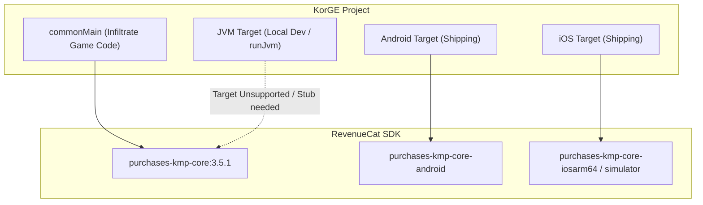

# Requirements

### Overview & Goals
The objective of this task is to integrate the RevenueCat Kotlin Multiplatform SDK (`purchases-kmp-core`) into `commonMain` in `build.gradle.kts` for the *Infiltrate: Shadow Heist* cross-platform KorGE game, use the latest stable version available on Maven Central, and evaluate Gradle dependency resolution and JVM desktop execution (`runJvm`).

### Scope
- **In Scope:**
  - Add `com.revenuecat.purchases:purchases-kmp-core:3.5.1` to the `commonMain` dependencies block in `build.gradle.kts`.
  - Maintain the rule of **NO Compose Multiplatform** dependencies (specifically avoiding `purchases-kmp-ui`).
  - Execute `gradlew.bat dependencies` to test resolution.
  - Execute `gradlew.bat runJvm` to test compilation and runtime launch.
  - Report findings for all 5 specific questions (exact version, resolution success/failure, specific error logs/metadata ABI details, `runJvm` execution status, and active Kotlin version).
- **Out of Scope:**
  - Adding `purchases-kmp-ui` or any Jetpack/JetBrains Compose libraries.
  - Modifying in-game scene gameplay or paywall UI rendering code.

### User Stories
- As a developer, I want to add `purchases-kmp-core` to the shared common source set so that in-app purchase logic can be shared between Android and iOS targets.
- As a developer, I want to verify Gradle dependency resolution and KorGE JVM desktop testing compatibility to catch any Kotlin version or multiplatform target mismatch early.

### Functional Requirements
- **FR-1:** Dependency declaration in `build.gradle.kts` must use `com.revenuecat.purchases:purchases-kmp-core:3.5.1`.
- **FR-2:** Dependency resolution must be analyzed for all configured KorGE targets (`jvm`, `js`, `wasm`, `desktop`, `ios`, `android`).
- **FR-3:** Diagnostic evaluation must capture any Kotlin ABI / metadata version incompatibility (e.g., Kotlin 1.9.22 project vs. Kotlin 2.x library metadata) and target mismatch (RevenueCat KMP supporting Android & iOS only).
- **FR-4:** KorGE `runJvm` task must be tested and its execution status reported.

# Technical Design

### Current Implementation
- **Project Structure:** KorGE 6.0.0 game project targeting Android, iOS, JVM desktop, JS, Wasm, and Desktop native.
- **Build Configuration:** `build.gradle.kts` uses `alias(libs.plugins.korge)` with KorGE plugin `6.0.0` defined in `gradle/libs.versions.toml`.
- **Kotlin Version:** Kotlin **1.9.22** (embedded in KorGE Gradle Plugin 6.0.0 and Gradle 8.8 build environment).
- **Current Dependencies:**
  ```kotlin
  dependencies {
      add("commonMainApi", project(":deps"))
  }
  ```

### Key Decisions
1. **SDK Artifact & Version Selection:**
   - Artifact: `com.revenuecat.purchases:purchases-kmp-core`
   - Version: `3.5.1` (latest stable release published on Maven Central).
   - Omit `purchases-kmp-ui` completely to adhere strictly to the project constraint of avoiding Compose Multiplatform.
2. **Target & Compatibility Assessment:**
   - `purchases-kmp-core` is published with metadata for `android` and `ios` (`iosArm64`, `iosSimulatorArm64`, `iosX64`) using Kotlin 2.x compiler metadata.
   - The project currently defines `targetJvm()`, `targetJs()`, `targetWasm()`, and `targetDesktop()` in addition to `targetIos()` and `targetAndroid()`. Adding `purchases-kmp-core` directly to `commonMain` tests whether Kotlin 1.9.22 multiplatform resolution can resolve common metadata when non-mobile targets are present.

### Proposed Changes
In `build.gradle.kts`:
```kotlin
dependencies {
    add("commonMainApi", project(":deps"))
    add("commonMainApi", "com.revenuecat.purchases:purchases-kmp-core:3.5.1")
}
```

### Architecture Diagram


### Key Compatibility Findings
- **Kotlin Version:** `1.9.22`
- **Library Compatibility:** `purchases-kmp-core:3.5.1` utilizes Kotlin 2.x metadata format and targets Android & iOS.
- **Execution impact:** `runJvm` on JVM desktop will expose whether the JVM compilation fails to find a JVM variant or fails due to Kotlin metadata format versions (Kotlin 1.9.22 reader cannot read Kotlin 2.x metadata without compiler flags / upgrade).

# Testing

### Validation Approach
Verification is performed via Gradle tasks executed from terminal in non-interactive mode.

### Key Scenarios
1. **Dependency Resolution (`.\gradlew.bat dependencies`):**
   - Verify Gradle successfully fetches `com.revenuecat.purchases:purchases-kmp-core:3.5.1` from `mavenCentral()`.
   - Inspect dependency tree for `commonMainImplementation`, `androidMainCompileClasspath`, `iosX64CompileClasspath`, and `jvmCompileClasspath`.
2. **JVM Runtime Execution (`.\gradlew.bat runJvm`):**
   - Execute the KorGE desktop launcher.
   - Observe if the window initializes or if a compilation / metadata error terminates the build.
3. **Build Environment Check (`.\gradlew.bat buildEnvironment`):**
   - Confirm active Kotlin compiler plugin version in KorGE is `1.9.22`.

### Error Diagnostics Checklist
- Check for `Incompatible Kotlin metadata version` (e.g. metadata version 2.0.0 vs 1.9.0).
- Check for `Cannot choose between the following variants ... no matching variant for target 'jvm'`.
- Report specific stack traces and error messages verbatim.

# Delivery Steps

### ✓ Step 1: Add purchases-kmp-core dependency to build.gradle.kts and verify dependency resolution
`com.revenuecat.purchases:purchases-kmp-core:3.5.1` is declared in `build.gradle.kts` in `commonMain` dependencies and Gradle dependency resolution is executed.

- Inspect `build.gradle.kts` dependencies block and add `add("commonMainApi", "com.revenuecat.purchases:purchases-kmp-core:3.5.1")` without introducing any `purchases-kmp-ui` or Compose dependencies.
- Execute `.\gradlew.bat dependencies` to test dependency resolution across all configured targets (`jvm`, `js`, `wasm`, `desktop`, `ios`, `android`).
- Capture and log dependency resolution output, identifying any variant attributes, missing targets, or Kotlin metadata version errors.

### ✓ Step 2: Test runJvm execution and generate diagnostic compatibility report
The KorGE JVM runtime and compilation behavior are validated via `gradlew.bat runJvm` and a clear diagnostic report is compiled.

- Run `.\gradlew.bat runJvm` to test whether the JVM engine window launches or if compilation fails due to Kotlin 1.9.22 vs 2.x metadata incompatibility or missing JVM variant in `purchases-kmp-core`.
- Check and verify the exact Kotlin version used by the KorGE 6.0.0 Gradle plugin (`1.9.22`).
- Document all 5 required points: exact SDK version, dependency resolution outcome, specific compiler/metadata error details if failed, `runJvm` launch result, and active Kotlin version.