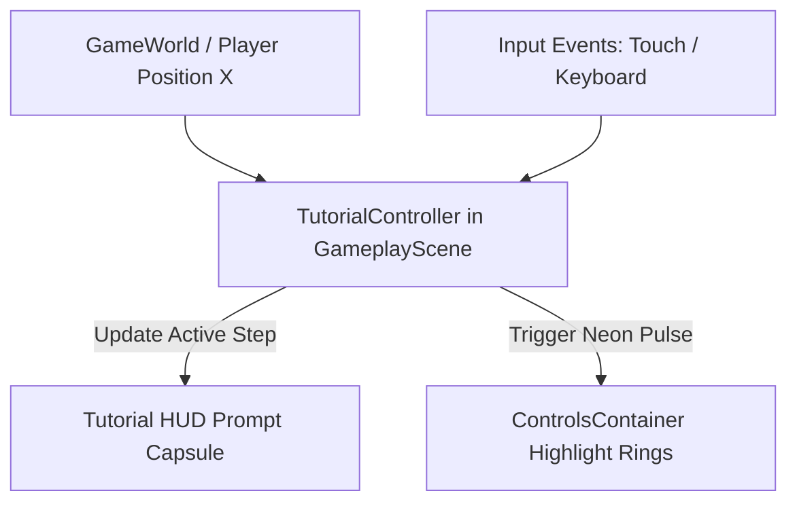

# Requirements

### Overview & Goals
Provide a seamless, immersive, and high-utility onboarding tutorial for *Infiltrate: Shadow Heist* built directly into Level 1 ("01: Night Arrival"). To maximize player learning efficiency and minimize unnecessary cognitive friction, the tutorial directly guides operatives through essential core mechanics—running, jumping/vaulting over crates and trucks, stealth crouching under low hanging obstacles, and reaching the objective—using dynamic cyber-tactical HUD prompts and targeted control highlighting.

### Scope
- **In Scope**:
  - 4 focused, high-impact tutorial milestones mapped to key Level 1 corridor landmarks.
  - Floating tactical HUD prompt capsule at top-center styled with the game's Bebas Neue typography and neon cyan/gold/green accents.
  - Active control button highlighting (glowing pulse ring on touch D-pad, jump, or crouch buttons; keyboard key badges for desktop).
  - Dynamic progression that responds to player position, executed player actions, and direction of travel.
  - Compatibility with both standard and left/right-handed swapped touch controls.
- **Out of Scope**:
  - Superfluous prompts for intermediate platforming steps that add cognitive clutter without introducing new mechanics.
  - Intrusive freeze-frame blocking modal dialogues that halt gameplay flow.
  - Pre-rendered tutorial video cutscenes.
  - Modifying the verified physical geometry of Level 1 (`smallCrate`, `truck`, `longPlatform`, `hangingChainedCrate`, `stepDownCrate`, `barrels`, `entrance`).

### User Stories
- **As a new player**, I want clear and prompt visual cues on how to control the operative so that I can learn movement, climbing, and stealth mechanics with maximum clarity and minimal distraction.
- **As a mobile player**, I want the relevant on-screen touch buttons to glow when a specific action is needed so that I can immediately associate controls with in-game actions.
- **As an experienced player**, I want tutorial prompts to fade away smoothly without blocking my view or stalling gameplay momentum if I sprint through the level quickly.

### Functional Requirements
1. **4 Contextual Level 1 Milestones**:
   - **Milestone 1 — Movement & Navigation** (`x: 235..450`): Prompt operative to move forward using on-screen chevrons or `[A / D]` / `[LEFT / RIGHT]`.
   - **Milestone 2 — Jump & Mantle / Climb** (`x: 450..850`): Prompt operative approaching the crate (`x: 550`) and truck (`x: 618`) to tap `[JUMP]` or press `[W / SPACE]` to hop and vault onto elevated surfaces.
   - **Milestone 3 — Stealth Crouch & Crawl** (`x: 1050..1450`): Prompt operative on the elevated platform approaching the hanging chained crate (`x: 1280`, 58px clearance) to hold `[CROUCH]` or `[S / C / CTRL]` to crawl silently underneath.
   - **Milestone 4 — Reach the Objective** (`x: 3000..3500`): Prompt operative approaching the security checkpoint booth (`x: 3395`) to reach the objective and complete the infiltration.
2. **HUD Presentation & Visual Polish**:
   - Semi-translucent dark capsule (`COLOR_DARK_BG`) with glowing cyan/gold border accents positioned at top-center (`y ≈ 20.0`), clear of the stealth radar and pause button.
   - Smooth alpha tweening (0.2s fade-in, 0.3s fade-out) when transitioning between steps.
   - Visual control highlight: pulsating neon glow on the targeted virtual button in `controlsContainer`.
3. **Control Swapping & Responsive Layout**:
   - Control highlights dynamically match the active position of buttons when `isControlsSwapped` is enabled.
   - Text prompts adapt to platform input (displaying touch icon badges on mobile, key labels on desktop).

### Non-Functional Requirements
- **Performance**: Zero allocation during frame rendering; GPU vector rendering via `uiGraphics()` to maintain crisp lines at any device resolution.
- **Determinism**: Fully decoupled logic in `game.model` / `TutorialStep` ensuring consistent state across Android, iOS, and JVM.

# Technical Design

### Current Implementation
- **Level 1 Geometry (`GameWorld.createDefault`)**: Spans a 3900-unit corridor featuring security fences (`x: -80..221`), small crate (`x: 550`), 3-tier truck (`x: 618..880`), long platform (`x: 880..1780`), hanging chained crate with 58px crouch clearance (`x: 1280`), step-down crate (`x: 1780`), `block2` (`x: 2048`), 7 barrels (`x: 2388..2612`), `block3` (`x: 2612`), and extraction booth (`x: 3395`).
- **HUD & Touch Controls (`GameplayScene.kt`)**: Renders fixed `hudLayer` and `controlsContainer` with GPU vector touch buttons (`createImgBtn` / `createTouchBtn`).

### Key Decisions
1. **Contextual Spatial Zones with Action Completion**:
   - *Chosen Approach*: Define `TutorialStep` objects with spatial `minX..maxX` activation windows, marked completed either when the player executes the target action or travels past the milestone.
   - *Rationale*: Allows organic discovery for new players while never trapping or stalling speedrunners who move through the level rapidly.
2. **Non-Intrusive Floating HUD Callout**:
   - *Chosen Approach*: A sleek, animated top-center capsule layered above gameplay worldView with pulsating button highlight rings.
   - *Rationale*: Preserves mobile screen real estate and avoids breaking immersion with modal popups.
3. **Data-Driven Step Definition in Domain Model**:
   - *Chosen Approach*: Store tutorial milestones as optional metadata on `LevelData` (`tutorialSteps: List<TutorialStep>`), keeping `src/game/model` 100% pure Kotlin standard library.
   - *Rationale*: Conforms to the project's composite build architecture where `src/game/model` is shared between `:game` (Kotlin 2.0.20) and `paywall-build` (Kotlin 2.3.20/2.4.10).

### Data Models / Contracts
```kotlin
enum class TutorialAction {
    MOVE, JUMP_VAULT, CROUCH, REACH_OBJECTIVE
}

enum class TutorialControlHighlight {
    NONE, MOVE_RIGHT, JUMP, CROUCH, INTERACT
}

data class TutorialStep(
    val id: String,
    val triggerMinX: Double,
    val triggerMaxX: Double,
    val title: String,
    val instructionTouch: String,
    val instructionDesktop: String,
    val targetAction: TutorialAction,
    val highlight: TutorialControlHighlight = TutorialControlHighlight.NONE
)
```

### Components & File Structure
- `src/game/model/LevelData.kt`: Adds `TutorialStep` definition and sets `tutorialSteps` for `DEFAULT_LEVEL_1`.
- `src/game/scene/UiComponents.kt`: Adds `drawTutorialCapsule` and `drawButtonHighlightRing` GPU vector rendering helpers.
- `src/game/scene/GameplayScene.kt`: Instantiates the tutorial prompt capsule in `hudLayer`, adds pulse overlay graphics to `controlsContainer`, and evaluates step transitions in `addUpdater`.

### Architecture Diagram


### Risks & Mitigations
- **Risk**: Player moves backward or oscillates around a trigger boundary, causing rapid flickering of tutorial prompts.
  - *Mitigation*: Track a `completedStepIds` set so each tutorial step is triggered once per run and stays active until completed or naturally superseded.
- **Risk**: Control highlight ring misaligned in left-handed swapped mode (`isControlsSwapped`).
  - *Mitigation*: Anchor highlight rings directly inside each button's container rather than absolute coordinates.

# Testing

### Validation Approach
Verification combines unit tests in `test/GameplayModelTest.kt` for data-model integrity and state progression math, alongside interactive JVM visual checks (`./gradlew runJvm`) for layout, animations, and typography rendering.

### Key Scenarios
1. **Standard Playthrough**:
   - Spawn at `x = 235`: Movement prompt displayed; right movement button highlighted.
   - Approach crate at `x = 450..550`: Jump/Vault prompt displayed; Jump button highlighted with green pulse.
   - On long platform approaching `x = 1050`: Crouch prompt displayed; Crouch button highlighted with gold pulse.
   - Entering crouch stance: Crouch action validated and prompt transitions smoothly.
   - Reaching `x = 3000`: "Reach the Objective" prompt displayed; fades out upon touching exit zone.
2. **Speedrun / Rapid Traversal**:
   - Player sprints continuously through triggers; prompts transition cleanly without visual overlap or stuck overlays.
3. **Swapped Controls Mode**:
   - Enable `controlsSwapped = true` in GameProfile; verify highlight rings land exactly on the relocated Jump, Crouch, and D-pad positions.

### Edge Cases
- **Pause & Resume**: Pausing while a tutorial prompt is active keeps the prompt visible under the pause scrim and resumes pulsing on unpause.
- **Level Restart / Retry**: Restarting Level 1 resets `TutorialController` state cleanly so prompts guide the player afresh.
- **Death / Mission Failed**: All tutorial prompt layers hide immediately when `caughtOverlay` is displayed.

# Delivery Steps

### ✓ Step 1: Define tutorial milestone data model and Level 1 trigger zones
Define the domain model and trigger zones for tutorial milestones in Level 1.

- Add a `TutorialStep` data class (id, trigger range, title, instruction, action type, and highlight target) to `src/game/model/LevelData.kt`.
- Attach `tutorialSteps` to `LevelData.DEFAULT_LEVEL_1` mapping out the 4 focused milestones: Movement (Spawn), Jump/Vault (Crate & Truck), Crouch (Hanging Crate), and Reach the Objective (Checkpoint Booth).
- Add unit tests in `test/GameplayModelTest.kt` verifying tutorial step definition bounds and sequencing.

### ✓ Step 2: Build tutorial HUD prompt capsule and control button highlighting
Implement the tactical tutorial callout UI and button highlight visual effects in GameplayScene.

- Create a `tutorialLayer` in `src/game/scene/GameplayScene.kt` rendering a floating neon-cyber prompt capsule (title, instruction text, and dynamic input glyphs for both touch and desktop keys).
- Implement animated glowing pulse / border highlight overlays on on-screen touch buttons (`jump`, `crouch`, `left`/`right`) inside `controlsContainer`.
- Support left/right handed swapped controls mode seamlessly so highlights follow button positions accurately.
- Add smooth alpha fade-in and fade-out transitions when entering and completing tutorial steps.

### ✓ Step 3: Wire update loop progression, action completion, and verification
Connect tutorial state management into the gameplay update loop and validate Level 1 walkthrough.

- Implement a `TutorialController` inside `GameplayScene.kt` that tracks player x-position and input actions to advance tutorial steps in real time.
- Wire auto-dismissal when the player successfully performs the prompted action (e.g., crouching under the hanging crate) or traverses past the milestone.
- Verify the complete Level 1 tutorial walkthrough via JVM test suite and desktop preview, testing normal progression, speedrunning, backtracking, and paused states.